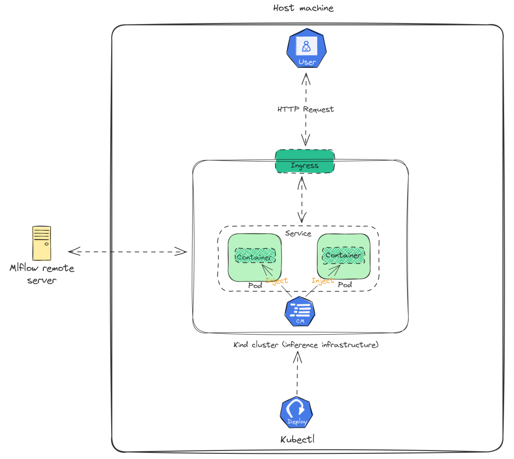

# Service
A web applciation (powered by fast api) that receives forecasting requests for different time ranges and for five 
different store ids. Example of a request body (post) and its response:

Request (post):

```json
[
    {
        "store_id": "1",
        "begin_date": "2023-01-02",
        "end_date": "2023-01-07"
    },
    {
        "store_id": "2",
        "begin_date": "2023-01-02",
        "end_date": "2023-01-07"
    }
]
```

Response:

```json
[
    {
        "request": {
            "store_id": "1",
            "begin_date": "2023-01-02",
            "end_date": "2023-01-07"
        },
        "forecast": [
            {
                "timestamp": "2023-01-02T00:00:00",
                "value": 7107
            },
            {
                "timestamp": "2023-01-03T00:00:00",
                "value": 6453
            },
            {
                "timestamp": "2023-01-04T00:00:00",
                "value": 6199
            },
            {
                "timestamp": "2023-01-05T00:00:00",
                "value": 5976
            },
            {
                "timestamp": "2023-01-06T00:00:00",
                "value": 6164
            },
            {
                "timestamp": "2023-01-07T00:00:00",
                "value": 6230
            }
        ]
    },
    {
        "request": {
            "store_id": "2",
            "begin_date": "2023-01-02",
            "end_date": "2023-01-07"
        },
        "forecast": [
            {
                "timestamp": "2023-01-02T00:00:00",
                "value": 7069
            },
            {
                "timestamp": "2023-01-03T00:00:00",
                "value": 6205
            },
            {
                "timestamp": "2023-01-04T00:00:00",
                "value": 6653
            },
            {
                "timestamp": "2023-01-05T00:00:00",
                "value": 5757
            },
            {
                "timestamp": "2023-01-06T00:00:00",
                "value": 5385
            },
            {
                "timestamp": "2023-01-07T00:00:00",
                "value": 3446
            }
        ]
    }
]
```  

When there is no model with `stage = production` for a store id (e.g., the rmse of the prophet model was too high during the train), then the `forecast` field will take a string value (`Forecase is not possible for this store id at the moment`)


| **API endpoint** | **Type** | **Desc** |
| --- | --- | --- |
| localhost:8000/forecast/ | Post | Forecasting requests for selected stored ids <br> and time ranges (see example above) |
| localhost:8000/health/ | Get | Checks if the mlflow server is operational |

## Training
Train 5 different time-series models (based on [prophet](https://pypi.org/project/prophet/)) using a kaggle dataset (`microservice/train_forecasters_ray.py`) and put the models stage to `production` if the root-mean-square-error (rmse) is `<=` the threshold set in `microservice/config.yaml`. To get the dataset, we will use the kaggle python package. 

## Experiment tracking and model registry
Use a remote Mlflow server for experiment tracking purposes and as a model registry (s3 backend).  

## Serve
Download the registered Prophet models (for each store id) from the Mlflow artifactory location 
and make predictions for the requested store id and the time range. The web application can run on a kind kubernetes
cluster (`kube-deploy.yaml`) or in a standalone docker container (`docker-compose.yaml`). In the former case, an ingress load balancer is used to communicate with the inference service from outside of the cluster. 

To initialize the web application in the container, a few environment variables will be injected (through a configmap while deploying in a kind cluster or via secrets, otherwise) into the container before starting the service.   

## Usage
| **File/Dir** | **Desc** |
| --- | --- |
| `target-dir` | Files created by targets in the Makefile are pushed here |
| `microservice` | Source code for the app |
| `Dockerfile` | Instructions to create the docker image of the app |
| `Makefile` | Environment management and automation of the workflows |
| `docker-compose.yaml` | Container orchestration (*) |
| `kind-cluster-configurations.yaml` | Configurations for the kind k8s cluster (**) |
| `kube-deploy.yaml` | Manifest to deploy the app in the kind cluster |

## Inference Service Component Graph
<p align="center"></p>